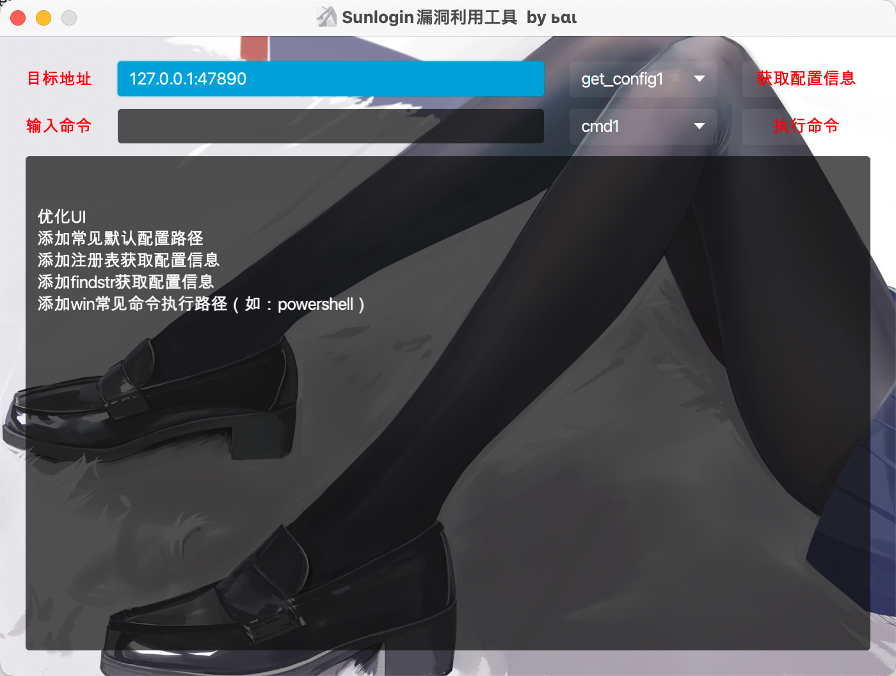
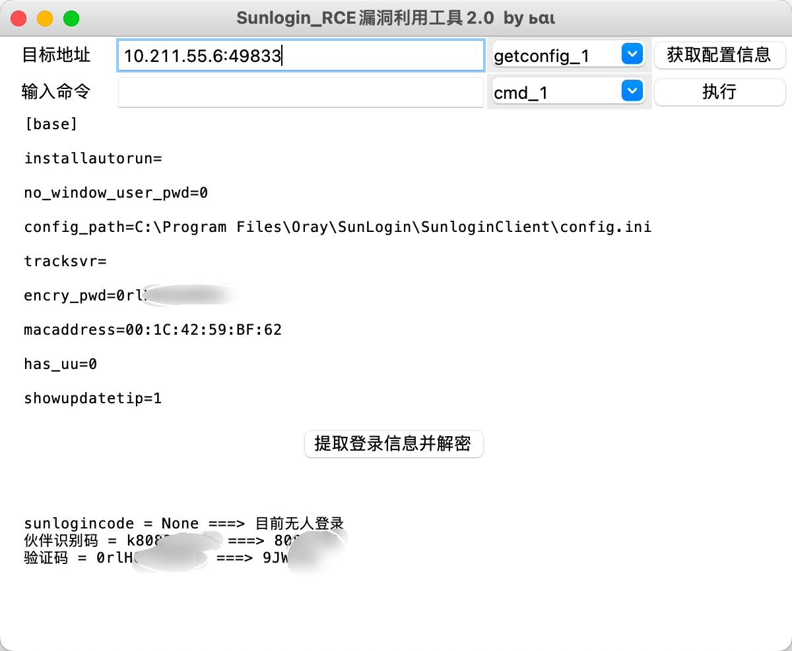
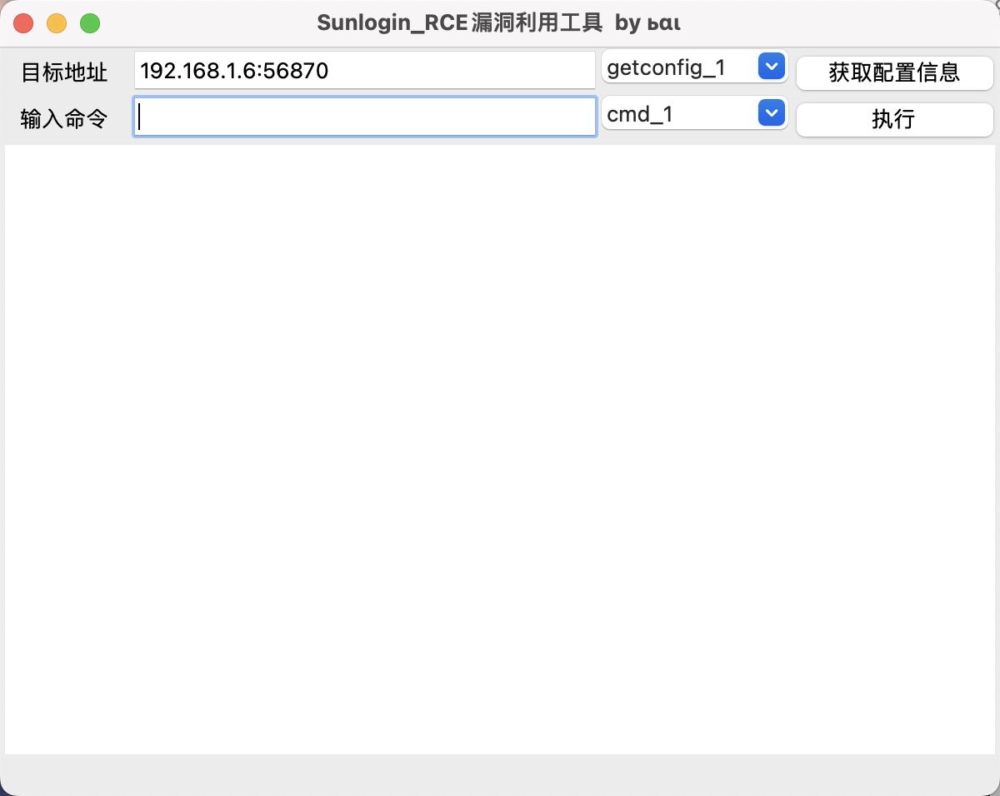
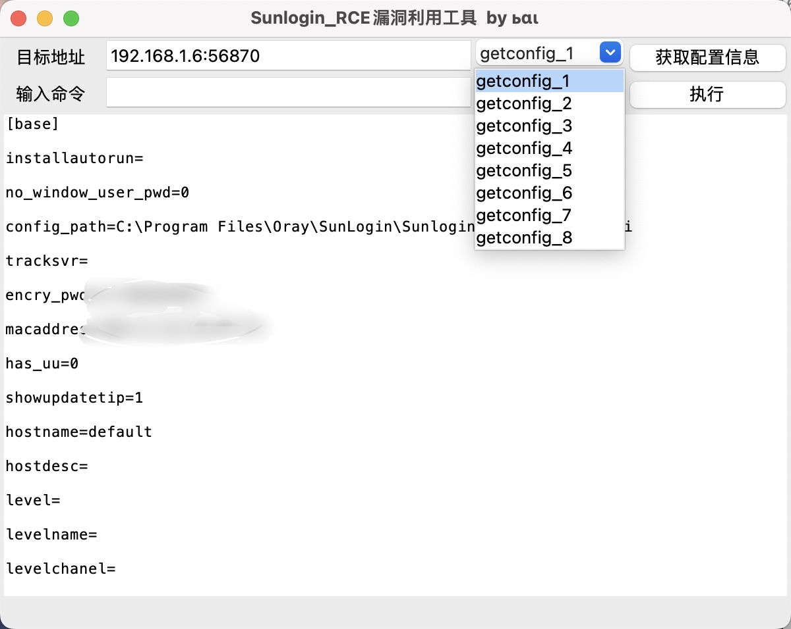
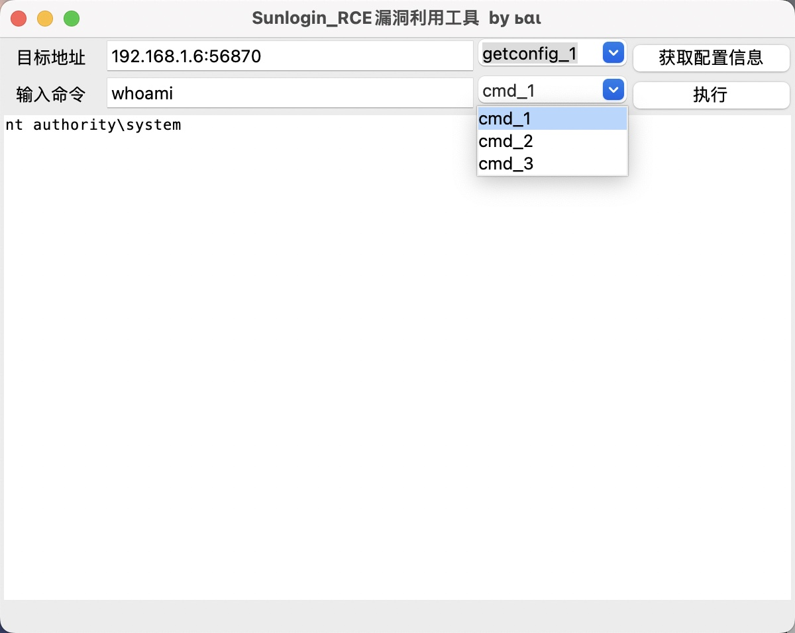

<h1 align="center" >Sunlogin_RCE-GUI-</h1>
<h3 align="center" >一款针对向日葵漏洞端口进行快速利用的图形化工具</h3>
 

    
    
    
     
  
     
     
	

# Java版

全新UI界面改良版（java8编写）

# Python版

## 2.0

增加一键提取登录信息

## 1.0

初版主要长这样，集成了获取配置信息（读取向日葵的配置文件）和执行命令功能。

### 获取配置信息

该模块主要通过powershell、注册表、findstr命令来获取目标站点的配置文件信息；

该模块集成了实战过程中遇到过的各个向日葵配置文件路径。

### 执行系统命令

该模块主要通过cmd和powershell来执行系统命令；

发现其他方法的话后续会进行添加。

# 巨人的肩膀

https://github.com/wafinfo/Sunflower_get_Password

# ⚠️ 免责声明

​	此工具仅作为网络安全攻防研究交流，请使用者遵照网络安全法合理使用！ 如果使用者使用该工具出现非法攻击等违法行为，与本作者无关！
